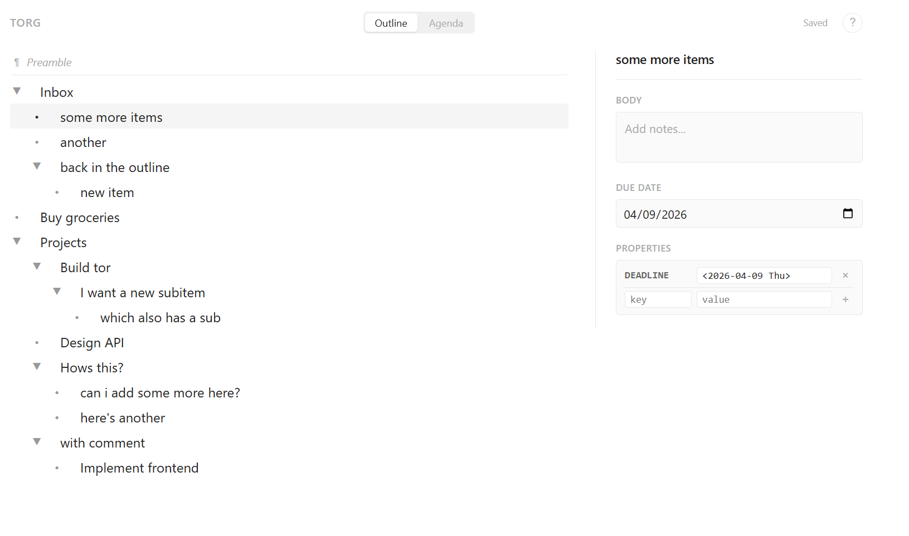
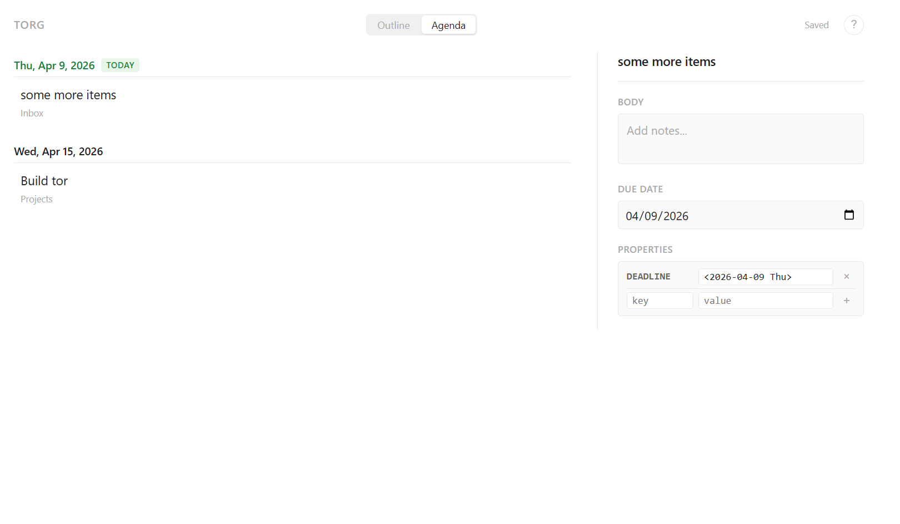

# torg

A keyboard-driven outliner with an org-mode file backend. Think Workflowy meets Todoist, backed by plain text.

Your data lives in a standard `.org` file — edit it in torg, Emacs, or any text editor. No database, no proprietary format.





## Features

- **Infinite nesting** — create deeply nested outlines with headings, sub-headings, and body text
- **Keyboard-first** — navigate, create, indent, move, and fold items without touching the mouse
- **Detail pane** — body text, due dates, and custom properties for the focused item
- **TODO/DONE status** — clickable badges on each item, stored as standard org-mode status keywords
- **Due dates** — date picker stored as `DEADLINE` in org properties
- **Agenda view** — see all dated items sorted chronologically, grouped by date, with overdue/today indicators
- **Fold to level** — Alt+1 through Alt+9 to collapse the entire outline to a specific depth
- **Preamble editing** — file-level content (like `#+TITLE`) editable via a dedicated preamble node
- **Multi-file** — point torg at a directory of `.org` files, switch between them with a file picker
- **Local-first editing** — all changes are instant; background sync pushes to disk every few seconds
- **Git-backed merge** — the directory is a git repo; external edits are three-way merged via `git merge-file`
- **Auto-commit** — git commits on load, after 20 minutes idle, and on shutdown
- **Single binary** — one Go binary, no npm, no build step for the frontend

## Quick start

```
go build -o torg .
./torg ~/org
```

Opens the `~/org` directory (created if it doesn't exist) and launches a browser. If the directory isn't a git repo, torg initializes one.

| Argument | Default | Description |
|----------|---------|-------------|
| `[directory]` | `.` | Directory containing `.org` files |
| `-addr` | `:8080` | Listen address |

## Keyboard shortcuts

### Navigation

| Key | Action |
|-----|--------|
| `Up` / `Down` | Move between items |
| `Enter` | Create new sibling item |
| `Backspace` | Delete empty item |
| `Shift+Enter` | Focus body text in detail pane |
| `Escape` | Return to outline from detail pane |

### Structure

| Key | Action |
|-----|--------|
| `Alt+Left` | Outdent (promote) |
| `Alt+Right` | Indent (demote) |
| `Alt+Up` | Move item up |
| `Alt+Down` | Move item down |

### Folding

| Key | Action |
|-----|--------|
| `Tab` | Fold/unfold children |
| `Alt+1` through `Alt+9` | Fold entire outline to level N |

## Architecture

```
browser (React)          Go server           disk
  local JSON tree  --->  PUT /api/doc  --->   .org file
  instant edits          JSON <-> org         plain text
                         version check
```

**Frontend** owns the document as a JSON tree. All editing — typing, indenting, moving, folding — happens as instant local state mutations. No network round-trip for any operation. A background sync pushes the full document to the server every 3 seconds when dirty.

**Backend** translates between JSON and org-mode format. Endpoints: `GET /api/files` lists org files, `GET /api/doc/:file` loads a file, `PUT /api/doc/:file` saves it. Parsing uses [go-org](https://github.com/niklasfasching/go-org). The frontend is pure ES modules with [htm](https://github.com/developit/htm) loaded from CDN — no npm, no bundler.

**Merge** uses SHA-256 hashes for change detection. On save, torg checks if the file changed on disk since it was last loaded. If so, it runs `git merge-file` for a three-way merge. Clean merges apply automatically; conflicts produce standard markers in the file.

**Git** auto-commits at three points: on file load (snapshot base), after 20 minutes of idle, and on server shutdown. Collapsed state is stored in a `.meta.json` sidecar so it doesn't clutter the org file.

## Org file format

torg reads and writes standard org-mode:

```org
#+TORG_VERSION: 5
* TODO Inbox
** DONE Buy milk
:PROPERTIES:
:DEADLINE: <2026-04-15 Wed>
:END:
** Write README
Body text goes here.
Multiple lines supported.
* Projects
** Build torg
:PROPERTIES:
:PRIORITY: high
:END:
```

## Development

The frontend lives in `internal/server/web/` and is embedded at compile time. Edit the HTML/CSS/JS, rebuild with `go build`, and refresh.

```
go build -o torg .
./torg .
```

## License

MIT
